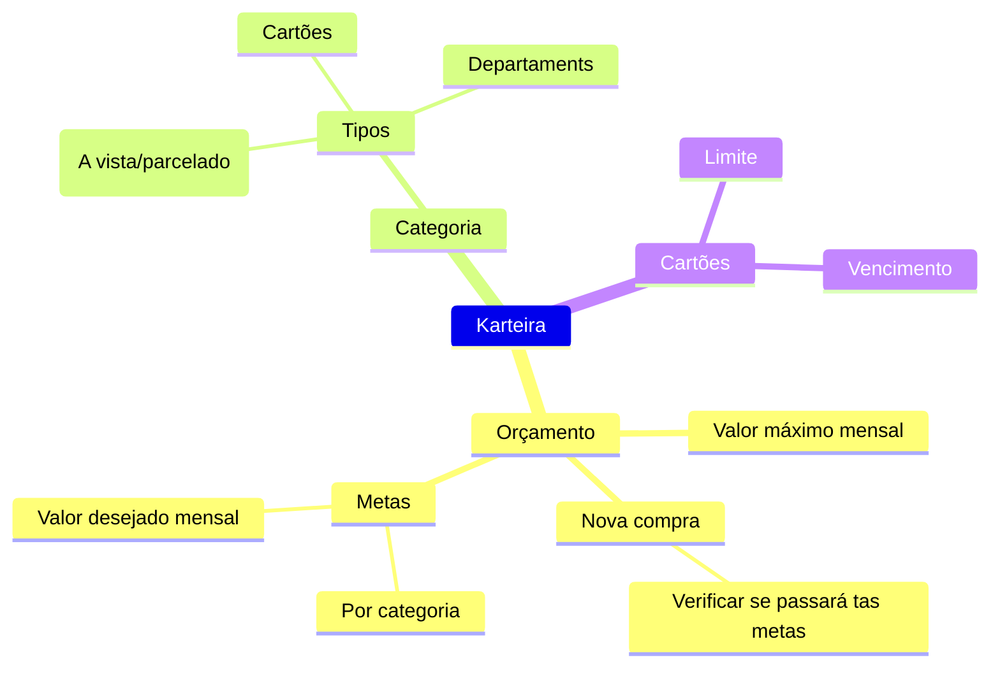
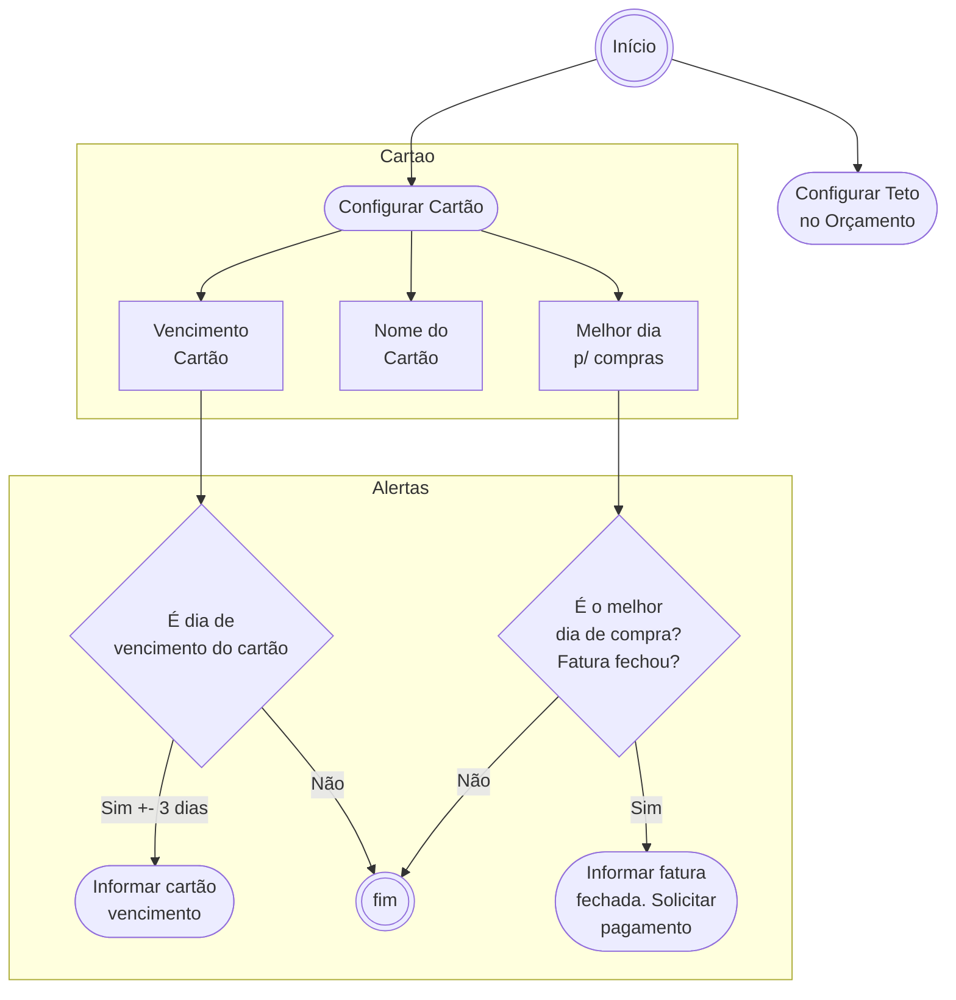
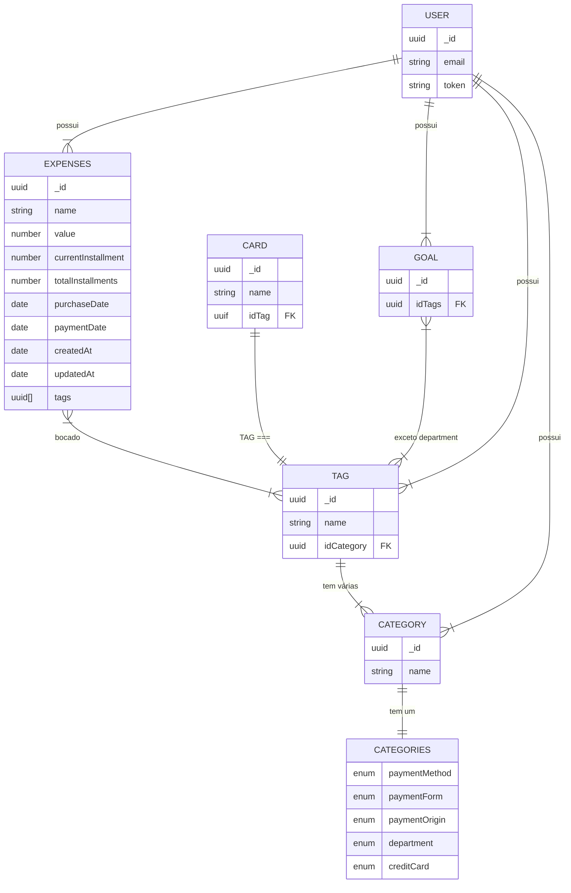

# Jangada Project

- [Jangada Project](#jangada-project)
  - [TODO](#todo)
  - [Funcionalidades](#funcionalidades)
    - [CRUDS](#cruds)
    - [Actions](#actions)
    - [Journey](#journey)
  - [Dados](#dados)

## TODO

## Funcionalidades

### CRUDS

- Despesas (core da aplicação)
- Cartão de crédito
  - Nome, vencimento, fechamento da fatura
  - Usado para alertar que alguma fatura está perto de vencer
  - Usado para alertar que fatura ainda não foi registrada como paga
- Teto de orçamento
  - Valor total de entradas
  - Informar quandos os gastos chegarem próximo ao teto
  - Informar quando passar do teto
- Meta de gastos
  - Diferente do teto de orçamento
    - Pois, aqui é uma meta que se pretende ter para gastos em geral
  - Usado para calcular uma previsão de compras
  - Pode ser dividido entre categorias
    - Por exemplo:
      - 4 mil de crédito (com a soma das compras em crédito)
      - 300 reais de assinaturas (soma das assinaturas, netflix, spotify etc)
      - 1000 de reservas de emergência (soma dos valores guardados)
- Previsão de compra
  - Valor da parcela
  - Quantidade de parcela
  - Indicar o melhor dia para efetuar a compra

### Actions

- Pagamento
  - Faz:
    - Incrementa as parcelas pagas
    - Se fechar parcelas faz highlight de que se encerrou
  - Tipos:
    - Tela por vencimentos
    - Tela por Cartões
    - Pagamento individual

### Journey

## Dados

